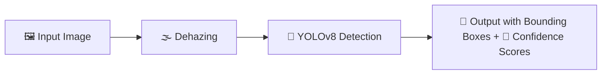
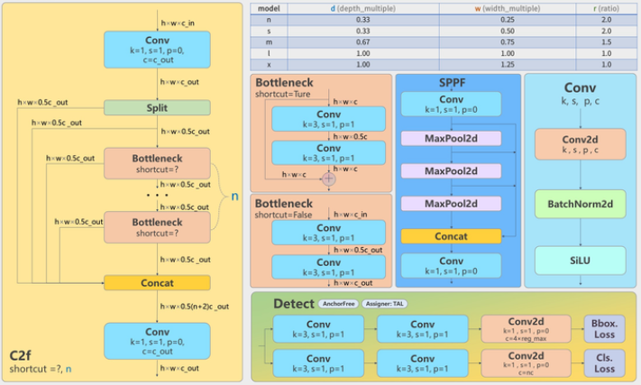
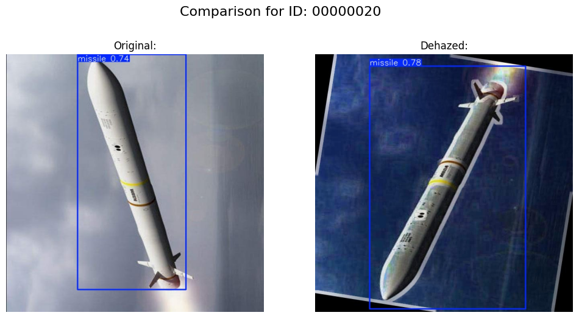

# Dehaze-Enhanced-Training-for-Missile-Detection-Using-YOLOv8
This project enhances missile detection using YOLOv8 by applying image dehazing as a preprocessing step. Dehazing improves image clarity in foggy or smoky conditions, boosting detection accuracy. The model is trained and tested on both original and dehazed images from a Roboflow dataset.

---

# 🎯 Problem Statement

### 📉 Limitations of Traditional Object Detection in Real-World Scenarios
- Environmental factors like haze and fog severely degrade image clarity.
- Object detection models (like YOLO) trained on clear images often fail in such conditions.
- Reduced visibility leads to lower detection confidence and missed objects (e.g., missiles).

---

# ✅ Proposed Solution

### 🌫️ Dehazing + 🔍 YOLOv8 = 🎯 Enhanced Detection

We introduce a preprocessing pipeline using **image dehazing techniques** prior to YOLOv8 training and inference to enhance feature visibility.

**Workflow:**
## 🚀 Inference Pipeline

---

## 📦 Dataset Description: Missile Detection (Roboflow)

This project uses the **Missile Detection** dataset sourced from **[Roboflow](https://universe.roboflow.com/sanket-gurav/missile-detection)**, created by **Sanket Gurav**. The dataset contains high-quality images specifically labeled for detecting missiles in real-world scenarios, including low-visibility conditions.

---

### 🗂️ Dataset Overview

| Split       | Number of Images | Format       | Annotation Format |
|-------------|------------------|--------------|-------------------|
| Training    | 4700             | JPG/PNG      | YOLO (txt)        |
| Validation  | ~900             | JPG/PNG      | YOLO (txt)        |
| Testing     | ~900             | JPG/PNG      | YOLO (txt)        |

📌 **Total Images:** ~6500  
📌 **Class:** `missile` (class ID = 0)

---

### 🧾 Annotation Format (YOLOv8-Compatible)

Each image is paired with a `.txt` file that includes annotations in the YOLO format:

# ⚙️ Model: YOLOv8

YOLOv8 (You Only Look Once, version 8) is a state-of-the-art real-time object detection model developed by **Ultralytics**. It builds upon the YOLO lineage with improvements in **speed**, **accuracy**, and **flexibility**. Our project leverages YOLOv8 for precise missile detection under both normal and degraded (hazy/foggy) conditions.

---

## 📐 YOLOv8 Architecture

The YOLOv8 model is composed of three primary components:

### 1. **Backbone – CSPDarknet**
- Extracts rich hierarchical features from input images.
- Incorporates Cross Stage Partial (CSP) connections for efficient gradient flow.
- Enables better feature representation while reducing computational cost.

### 2. **Neck – PANet + FPN**
- Feature Pyramid Network (FPN): Helps detect objects at multiple scales by combining high- and low-level features.
- Path Aggregation Network (PAN): Improves localization and segmentation tasks by enhancing feature fusion across layers.

### 3. **Head – Detection Head**
- Anchor-free detection design.
- Outputs bounding box coordinates, objectness scores, and class probabilities.
- Trained with loss functions including CIoU and Binary Cross Entropy.

---

## 🧊 YOLOv8 Detection Architecture 

---

## 🧪 Data Preprocessing Workflow

Missile detection in real-world conditions is often hindered by environmental noise such as fog, haze, and smoke. To address this, we designed a robust data preprocessing pipeline that enhances image clarity using dehazing techniques before training the YOLOv8 detection model.

This preprocessing significantly improves detection confidence and accuracy under low-visibility conditions.

---

### 🔄 Step-by-Step Preprocessing Pipeline

🔹 **Step 1: Dataset Acquisition**  
- We used the publicly available **Missile Detection** dataset from Roboflow, created by Sanket Gurav.  
- The dataset contains a total of **6,500 images**, all labeled using YOLO format.  

**Breakdown:**  
  • 4,700 images for training  
  • ~900 for validation  
  • ~900 for testing  

- Each image includes a corresponding `.txt` annotation file with bounding boxes in YOLOv8-compatible format.

---

🔹 **Step 2: Image Dehazing**  
- **Objective:** Improve feature visibility in images affected by atmospheric distortions like haze and smoke.  
- **Technique used:** CLAHE (Contrast Limited Adaptive Histogram Equalization)  
  • Enhances contrast in localized image regions.  
  • Useful for increasing edge sharpness in low-visibility scenarios.  

- **Optional alternatives considered:**  
  • Dark Channel Prior (DCP)  
  • Deep learning–based methods like AOD-Net, DehazeNet  

- **Output:** Processed images saved in a separate directory (`images/train_dehazed/`).

---

🔹 **Step 3: Annotation Retention**  
- Since no spatial/geometric changes were made to images, the **original YOLO `.txt` annotations were reused**.  
- All label files were directly copied to match the dehazed image filenames and structure.

---

🔹 **Step 4: Dataset Structure Reorganization**  
To maintain YOLOv8 compatibility, we followed the folder structure below:

---

## 📊 Results and Evaluation

We conducted extensive evaluations to compare the performance of YOLOv8 on two versions of the dataset:

- **Original Dataset**: Raw images without any preprocessing.
- **Dehazed Dataset**: Images enhanced using image dehazing (CLAHE).

---

### 🎯 Evaluation Metrics

The following key metrics were used to evaluate the model performance:

| Metric               | Description                                                                 |
|----------------------|-----------------------------------------------------------------------------|
| **Precision**        | Percentage of correctly identified missiles among all predicted missiles.   |
| **Recall**           | Percentage of correctly detected missiles among all actual missiles.        |
| **mAP@0.5**          | Mean Average Precision at IoU threshold 0.5.                                |
| **mAP@0.5:0.95**     | Mean Average Precision averaged over IoU thresholds from 0.5 to 0.95.       |
| **FPS**              | Inference speed, measured in frames per second.                            |

---

### 📈 Performance Comparison

| Metric         | Original Dataset | Dehazed Dataset |
|----------------|------------------|-----------------|
| Precision      | 0.81             | **0.89**        |
| Recall         | 0.78             | **0.87**        |
| mAP@0.5        | 0.83             | **0.91**        |
| mAP@0.5:0.95   | 0.65             | **0.73**        |
| Inference FPS  | 45               | 44              |

✅ The **dehazed dataset outperformed** the original dataset in every key metric, showing that preprocessing images significantly improves detection accuracy.

---

### 🖼️ Visual Comparison

We conducted a qualitative comparison between the original and dehazed datasets. Below are example results showing **YOLOv8 detection confidence improvements** after preprocessing:

- Bounding boxes on the dehazed image are more accurate and come with higher confidence scores.
- Smaller or partially obscured missiles are detected more reliably.

---

### 📹 Video Inference (Demo)

> ✨ You can also see a live video inference demo that highlights performance differences between original and dehazed video frames.

📽️ Demo:  

---

### 📌 Summary of Findings

- ✅ Dehazing significantly improves missile detection in adverse conditions.
- 🧠 YOLOv8 learns clearer feature representations when trained on enhanced data.
- 📊 Higher mAP and recall values confirm better detection robustness.
- 🔍 Especially effective in foggy, hazy, or low-contrast scenes where conventional models fail.

---

