# Dehaze-Enhanced-Training-for-Missile-Detection-Using-YOLOv8
This project enhances missile detection using YOLOv8 by applying image dehazing as a preprocessing step. Dehazing improves image clarity in foggy or smoky conditions, boosting detection accuracy. The model is trained and tested on both original and dehazed images from a Roboflow dataset.

---

# 🎯 Problem Statement

### 📉 Limitations of Traditional Object Detection in Real-World Scenarios
- Environmental factors like haze and fog severely degrade image clarity.
- Object detection models (like YOLO) trained on clear images often fail in such conditions.
- Reduced visibility leads to lower detection confidence and missed objects (e.g., missiles).

---

# ✅ Proposed Solution

### 🌫️ Dehazing + 🔍 YOLOv8 = 🎯 Enhanced Detection

We introduce a preprocessing pipeline using **image dehazing techniques** prior to YOLOv8 training and inference to enhance feature visibility.

**Workflow:**
## 🚀 Inference Pipeline

```mermaid
graph LR
A[🖼️ Input Image] --> B[🌫️ Dehazing]
B --> C[🧠 YOLOv8 Detection]
C --> D[🔲 Output with Bounding Boxes + 🎯 Confidence Scores]
```

---

## 📦 Dataset Description: Missile Detection (Roboflow)

This project uses the **Missile Detection** dataset sourced from **[Roboflow](https://universe.roboflow.com/sanket-gurav/missile-detection)**, created by **Sanket Gurav**. The dataset contains high-quality images specifically labeled for detecting missiles in real-world scenarios, including low-visibility conditions.

---

### 🗂️ Dataset Overview

| Split       | Number of Images | Format       | Annotation Format |
|-------------|------------------|--------------|-------------------|
| Training    | 4700             | JPG/PNG      | YOLO (txt)        |
| Validation  | ~900             | JPG/PNG      | YOLO (txt)        |
| Testing     | ~900             | JPG/PNG      | YOLO (txt)        |

📌 **Total Images:** ~6500  
📌 **Class:** `missile` (class ID = 0)

---

### 🧾 Annotation Format (YOLOv8-Compatible)

Each image is paired with a `.txt` file that includes annotations in the YOLO format:

# ⚙️ Model: YOLOv8

YOLOv8 (You Only Look Once, version 8) is a state-of-the-art real-time object detection model developed by **Ultralytics**. It builds upon the YOLO lineage with improvements in **speed**, **accuracy**, and **flexibility**. Our project leverages YOLOv8 for precise missile detection under both normal and degraded (hazy/foggy) conditions.

---

## 📐 YOLOv8 Architecture

The YOLOv8 model is composed of three primary components:

### 1. **Backbone – CSPDarknet**
- Extracts rich hierarchical features from input images.
- Incorporates Cross Stage Partial (CSP) connections for efficient gradient flow.
- Enables better feature representation while reducing computational cost.

### 2. **Neck – PANet + FPN**
- Feature Pyramid Network (FPN): Helps detect objects at multiple scales by combining high- and low-level features.
- Path Aggregation Network (PAN): Improves localization and segmentation tasks by enhancing feature fusion across layers.

### 3. **Head – Detection Head**
- Anchor-free detection design.
- Outputs bounding box coordinates, objectness scores, and class probabilities.
- Trained with loss functions including CIoU and Binary Cross Entropy.

---

## 🧊 YOLOv8 Detection Architecture 

